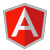
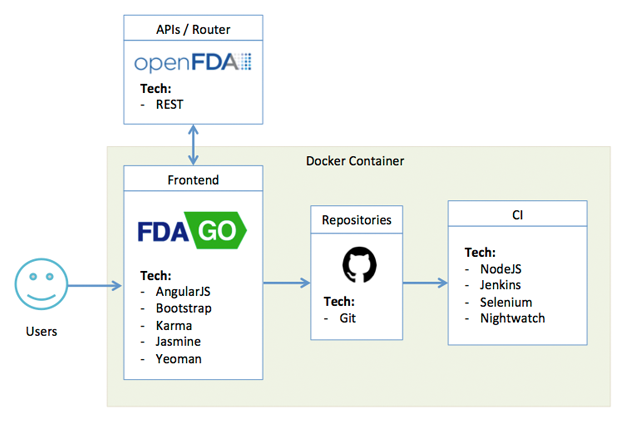

# What is FDA-GO?

FDA-GO is Concept Plus' working prototype submission in response to the 18F BPA for Agile Delivery Services. 

Project Links  | URLs 
 ------------- | ------------- 
 Production Application    | [fdago.conceptplusllc.net](https://fdago.conceptplusllc.net) 
 Development Environment    | [fdago-dev.conceptplusllc.net](https://fdago-dev.conceptplusllc.net) 
 CI Environment   | [fdago-ci.conceptplusllc.net](https://fdago-ci.conceptplusllc.net)
 Container Advisor  | [fdago-ca.conceptplusllc.net](https://fdago-ca.conceptplusllc.net)

#### Powered By




# Installation

_See the [FDA-GO Local Deployment Guide](https://github.com/concept-plus/fda-go/blob/BPA-57-1.0-open/LOCAL_DEPLOYMENT.md)_

# Team

Upon receipt of the RFQ, Yazan Ramahi was appointed and authorized to put a multidisciplinary team together to collaboratively design, develop, and deploy a working protoype.

Team members consisted of:
* **Product Owner:** Yazan Ramahi (yramahi@conceptplusllc.com)
* **Technical Architect:** Rory McLean (rmclean@conceptplusllc.com)
* **Program Manager / Scrum Master:** Hector Villagomez (hvillagomez@conceptplusllc.com)
* **Frontend Web Developer:** Ponnamy Kiep (pkiep@conceptplusllc.com)
* **Backend Web Developer:** Mike Mathis (mmathis@conceptplusllc.com)
* **DevOps Engineer:** Alex Rangeo (arangeo@conceptplusllc.com)

# Agile Aproach

_See our [Attachment E: Approach Criteria Evidence](./APPROACH_CRITERIA_EVIDENCE.md)_

Once the team was in place, we immediately held a project kickoff meeting to come up with ideas for the prototype.  Many ideas were presented to the product owner and the decision was made to create FDA-GO - a prototype allowing consumers to execute a drug search for its adverse events, labeling, and recalls. In addition, it also provides a fast way to get recall information for the past 12 months relating to drugs, medical devices, and food. FDA-GO consumes the [OpenFDA APIs](http://open.fda.gov).

The team decided to take a scrum approach for all development activities.  The team worked with the product owner and created the product backlog which identified various user and technical stories which were all created in JIRA.  The backlog was then groomed and refined so that development activities could begin.   All development was performed throughout a total of 4 sprints.  Each sprint consisted of:
1.	Planning session – development team decomposed and estimated each user and technical stories included in sprint.  
2.	Daily stand ups – decomposed tasks and activities are tracked and impediments are identified.
3.	Sprint demo – all completed user and technical stories were presented to stakeholders for acceptance.
4.	Sprint retrospective – lessons learned were captured and documented by the entire team.
Throughout each sprint all tasks were tracked and managed using JIRA and JIRA agile.  JIRA agile provided a virtual agile board which allowed the team to work remotely. All artifacts associated to each sprint along with a schedule can be found here.
While the development was ongoing the DevOps engineer and Technical architect identified tasks that needed to be completed from an infrastructure perspective.  All items were captured in JIRA and tracked through a Kanban board.  [Click here to see artifacts](./evidence/Sprint_Docs) 

All defects were captured within the sprint during our testing phase.   Defects were identified by the testers, created in JIRA and assigned to the developer assigned to the feature. Upon completion of the bug fix the defect was assigned back to the tester.  If all tests passed then the defect would be closed.

[ add content about first day(s) here. ]

[ include pictures of initial whiteboard design ]

[ add jira sprint info and maybe some screenshots ]

[ add info about bug tracking and resolution ]

# Technologies

Keeping in mind the short timeframe, we still wanted to create a prototype that worked on multiple devices while satisfying all of the criterias for this challenge. This was achieved with using many modern and open source technologies.



## Modern, Open Source Technologies

* **NodeJS** - Cross-platform runtime environment
* **AngularJS** - Front-end framework
* **Bootstrap** - Front-end UI framework
* **GruntJS** - Javascript task runner
* **Docker** - Container framework
* **Karma** - Unit testing framework
* **Jasmine** - Unit testing framework

## Other Technologies

* **Github** - Code repository
* **Jenkins** - Continuous integration
* **Selenium** - Browser automation
* **OpenFDA** - REST API
* **Amazon Web Services** - IaaS 

# Environments

* **Amazon Web Services** was used as our IaaS provider.
* **Docker** containerization of web application.
[ add content/screenshots here for Amazon, Docker, cAdvisor, etc. ]

[ describe CI process here ]

# Testing

## Unit Testing

Once you have FDA-GO setup on your local system. You can run the following command to execute the unit tests.
```
grunt test
```
The unit tests are created using (the open source frameworks for testing) [Karma](http://karma-runner.github.io/0.12/index.html), [PhantomJS](http://phantomjs.org/), and [Jasmine](http://jasmine.github.io/). Here is a [sample unit test run](./evidence/unittest.png).

## Autmated Testing

The following tools tied into our CI solution and triggered the execution of automated test scripts. All testing results were captured in the form of html reports.  Click here to view results of our automated tests.

* [Selenium](http://www.seleniumhq.org/) - web browser automation tool.
* [NightwatchJS](http://www.nightwatchjs.org/) - easy to use Node.js E2E testing solution for browser based apps and websites.
* [PhantomJS](http://phantomjs.org/) - headless webkit scriptable with a Javascript API.


# License

FDA-GO is licensed under the MIT license. For full details see the [LICENSE](./LICENSE.md) on github.
