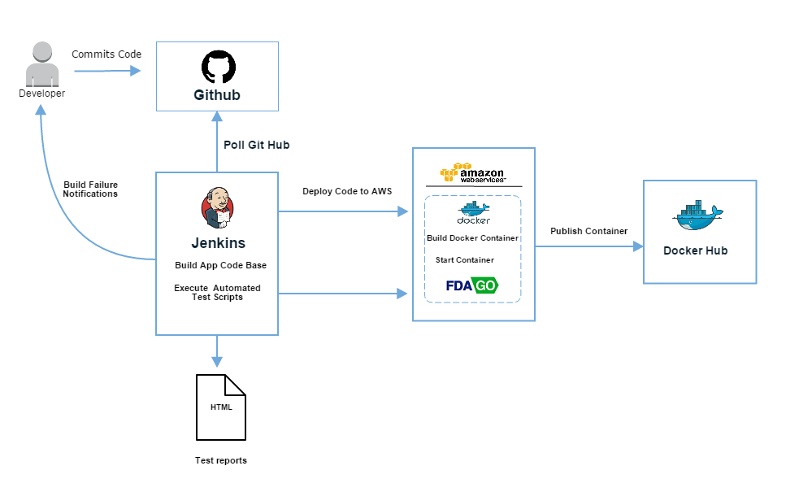

# What is FDA-GO?

FDA-GO is Concept Plus' working prototype submission in response to the 18F BPA for Agile Delivery Services for RFQ 4QTFHS150004

Project Links  | URLs 
 ------------- | ------------- 
 Production Application    | [fdago.conceptplusllc.net](https://fdago.conceptplusllc.net) 
 Development Environment    | [fdago-dev.conceptplusllc.net](https://fdago-dev.conceptplusllc.net) 
 CI Environment   | [fdago-ci.conceptplusllc.net](https://fdago-ci.conceptplusllc.net)
 Container Advisor  | [fdago-ca.conceptplusllc.net](https://fdago-ca.conceptplusllc.net)

#### Powered By


# Installation

_See the [FDA-GO Local Deployment Guide](./LOCAL_DEPLOYMENT.md)_

**Docker**  
  
_See the [Docker hub registry](https://registry.hub.docker.com/u/conceptplus/fdago/)_

# Team

Upon receipt of the RFQ, Yazan Ramahi was appointed and authorized to put a multidisciplinary team together to collaboratively design, develop, and deploy a working protoype.

[Team members](./evidence/Team) consisted of:
* **Product Manager:** Yazan Ramahi- Leader given authority, responsibility, and held accountable for the quality of the FDA-GO prototype.
* **Technical Architect:** (Category 2) - Rory McLean 
* **Frontend Web Developer:** (Category 6) - Ponnamy Kiep 
* **Frontend Web Developer:** (Category 6) - Dana Ramahi 
* **Backend Web Developer:** (Category 7) - Mike Mathis 
* **DevOps Engineer:** (Category 8) - Alex Rangeo 
* **DevOps Engineer:** (Category 8) - Hector Villagomez 

# Agile Approach

_See our [Attachment E: Approach Criteria Evidence](./evidence/gsa_ads_attachment_e_approach_criteria_evidence_template_mod_5-Development-Pool.xlsx)_

With a team in place, a project kickoff meeting was executed and ideas were presented to the product owner, leading to a decision to create FDA-GO; a site allowing consumers to execute a text search for a drug’s adverse events, labeling, and recall data. Consumers may also view recall information related to drugs, medical devices, and food for the past 12 months.

The team executed a scrum approach for all development activities. Working with the product owner, a product backlog was created identifying various user and technical stories.  Stories were captured in [JIRA](https://www.atlassian.com/software/jira) and then groomed and refined allowing development to begin.

Development was completed in 4 sprints. Each sprint consisted of: 
 * Planning session – development team decomposed and estimated the user and technical stories. 
 * Daily stand ups – decomposed tasks and activities were tracked and impediments identified.
 * Sprint demo – all completed user and technical stories were presented to stakeholders for acceptance. 
 * Sprint retrospective – lessons learned were captured and documented by the entire team.

Sprint tasks were tracked and managed using JIRA. A [virtual agile board](https://github.com/concept-plus/fda-go/blob/BPA-57-1.0-open/evidence/Sprint_Docs/Sprint%202/Sprint_2_WIP_1.png) allowed the team to work remotely. All artifacts associated to each sprint [can be found here.](https://github.com/concept-plus/fda-go/blob/BPA-57-1.0-open/evidence/Sprint_Docs)
Simultaneously, the DevOps engineer and Technical Architect identified tasks that needed to be completed from an infrastructure perspective. All items were captured in JIRA and tracked through a [Kanban board](./evidence/Operational_Tasks). [Click here to see artifacts](https://github.com/concept-plus/fda-go/blob/BPA-57-1.0-open/evidence/Sprint_Docs).

# Technologies

The prototype consumes the [OpenFDA APIs](http://open.fda.gov) and works on multiple devices while satisfying all of the criteria's for this challenge. This was achieved with using many modern and open source technologies.


## Modern, Open Source Technologies

* **[NodeJS](http://nodejs.org)** - Cross-platform runtime environment
* **[AngularJS](https://angularjs.org/)** - Front-end framework
* **[Bootstrap](http://getbootstrap.com)** - Front-end UI framework
* **[GruntJS](http://gruntjs.com/)** - Javascript task runner
* **[Docker](http://docker.com)** - Container framework
* **[Karma](http://karma-runner.github.io/)** - Unit testing framework
* **[Jasmine](http://jasmine.github.io/)** - Unit testing framework

## Other Technologies

* **[Github](http://github.com)** - Code repository
* **[Jenkins](https://jenkins-ci.org/)** - Continuous integration
* **[Selenium](http://www.seleniumhq.org/)** - Browser automation
* **[OpenFDA](http://open.fda.gov)** - REST API

# Environments

* **[Amazon Web Services](http://aws.amazon.com)** was used as our IaaS provider.


* **[Docker](http://docker.com)** containerization of web application.


## Continuous Integration

Our Continuous Integration implementation involved:
* Code check-in
* Jenkins polls and executes build to AWS
* AWS builds and starts Docker container
* Container is published to Docker Hub
* Upon [successful deployment of container](./evidence/Continuous Integration/fdago-production-build-output.rtf) Jenkins executes job to run automated tests
* [Test](./evidence/Continuous Integration/nightwatch-html-reports.pdf) and [Build](./evidence/Continuous Integration/Jenkins-Prod-Build-Pipeline.png) results produced


## Continuous Monitoring

For the scope of this effort, we have enabled multiple monitoring tools to monitor security, vulnerability, performance and health. Based on findings from periodic scans, appropriate action was taken.

* **[SSL Scans](./evidence/Continuous Monitoring/SSL-Server-Test-fdago.conceptplusllc.pdf)** - [Qualys](https://www.qualys.com/free-tools-trials/security-at-your-fingertips/)
* **[Open Web Application Security Project (OWASP)](./evidence/Continuous Monitoring/fdago-OWASP-Scan.pdf)** - [Qualys](https://www.qualys.com/free-tools-trials/security-at-your-fingertips/)
* **[Vulnerability](./evidence/Continuous Monitoring/fdago-threat-report.pdf)** - [Qualys](https://www.qualys.com/free-tools-trials/security-at-your-fingertips/)
* **[Container Monitoring](https://github.com/concept-plus/fda-go/blob/BPA-57-1.0-open/evidence/Continuous%20Monitoring/cAdvisorEvidence.docx?raw=true)** - [cAdvisor](https://fdago-ca.conceptplusllc.net/containers/)
* **[Machine Health / Usage](./evidence/Continuous Integration/AWS_ec2_alarms.png)** - [AWS CloudWatch](http://aws.amazon.com/cloudwatch/) [with real-time alerts](./evidence/Continuous Monitoring/ALARMUSNVirginia.pdf)

# Testing

## Unit Testing

Once you have FDA-GO setup on your local system. You can run the following command to execute the unit tests.
```
grunt test
```
The unit tests are created using the open source frameworks [Karma](http://karma-runner.github.io/0.12/index.html), [PhantomJS](http://phantomjs.org/), and [Jasmine](http://jasmine.github.io/).

## Automated Testing

The following tools tied into our CI solution and triggered the execution of automated test scripts. All testing results were captured in html reports. [Click here to view test results](./evidence/Continuous Integration/nightwatch-html-reports.pdf).

* [Selenium](http://www.seleniumhq.org/) - web browser automation tool.
* [NightwatchJS](http://www.nightwatchjs.org/) - Node.js E2E testing for browser based apps and websites.
* [PhantomJS](http://phantomjs.org/) - headless webkit scriptable with a Javascript API.

## 508 Testing

[508 findings](./test/508) were added to the backlog.

# License

FDA-GO is licensed under the MIT license. For full details see the [LICENSE](./LICENSE.md) on github.

# US Digital Playbook

Please refer to the ["evidence"](./evidence) folder.
